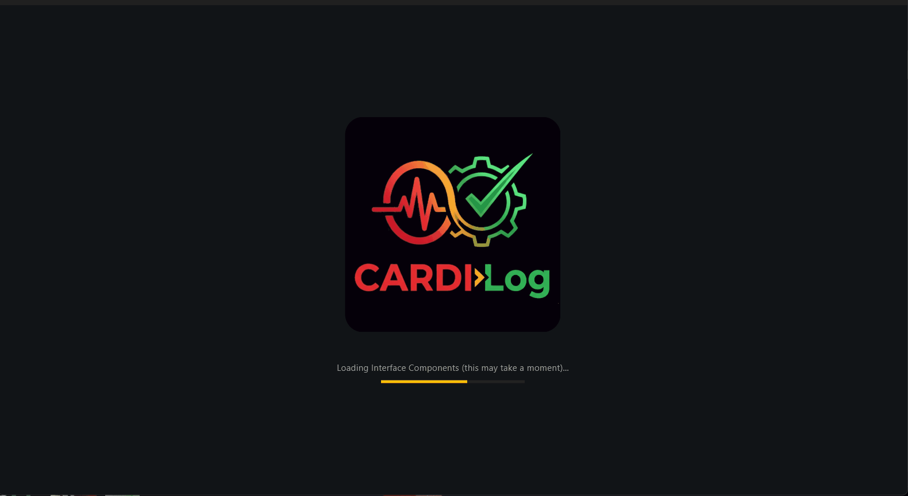

# CARDI Log

> **Note on Support:** This is a personal project shared to illustrate a specific approach to portfolio governance. While the codebase is open for reference and community forks, I am not currently providing active support, bug fixes, or feature updates. It is provided "as-is" for those interested in bridging the gap between lean PM practices and data integrity.



## Run the app

### uv

Run as a desktop app:

```
uv run flet run
```

Run as a web app:

```
uv run flet run --web
```

### Poetry

Install dependencies from `pyproject.toml`:

```
poetry install
```

Run as a desktop app:

```
poetry run flet run
```

Run as a web app:

```
poetry run flet run --web
```

For more details on running the app, refer to the [Getting Started Guide](https://flet.dev/docs/getting-started/).

## Build the app

### Android

```
flet build apk -v
```

For more details on building and signing `.apk` or `.aab`, refer to the [Android Packaging Guide](https://flet.dev/docs/publish/android/).

### iOS

```
flet build ipa -v
```

For more details on building and signing `.ipa`, refer to the [iOS Packaging Guide](https://flet.dev/docs/publish/ios/).

### macOS

```
flet build macos -v
```

For more details on building macOS package, refer to the [macOS Packaging Guide](https://flet.dev/docs/publish/macos/).

### Linux

```
flet build linux -v
```

For more details on building Linux package, refer to the [Linux Packaging Guide](https://flet.dev/docs/publish/linux/).

### Windows

```
flet build windows -v
```

For more details on building Windows package, refer to the [Windows Packaging Guide](https://flet.dev/docs/publish/windows/).
